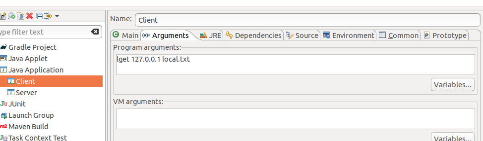
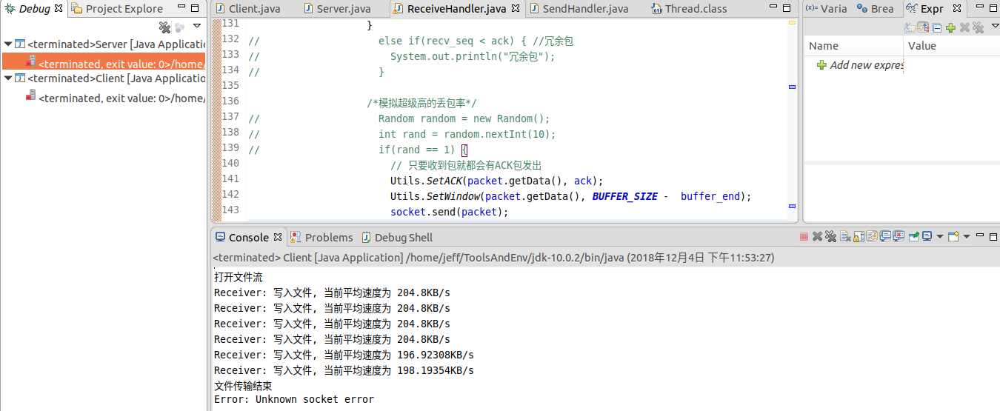
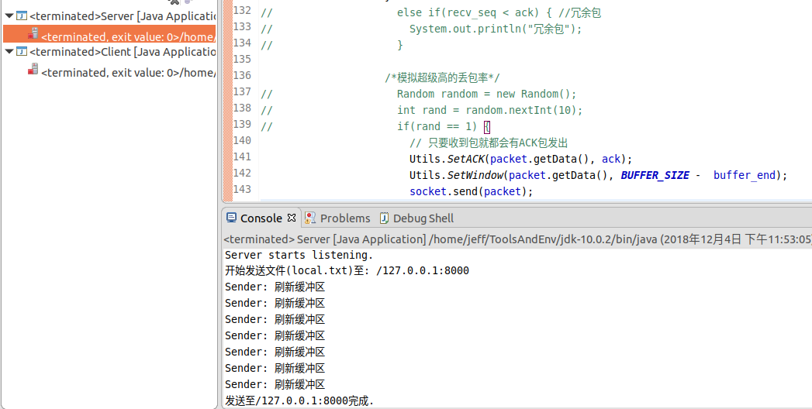

# LFTP

> 代码仓库可见于 https://github.com/zys980808/tcp_by_udp 
> **移步仓库查看最新版**

LFTP协议是使用UDP套接字实现的大文件可靠传输协议，它属于应用层协议。该协议在本项目中绑定到一个CS架构的文件传输应用当中。最终的项目源码见于 `LFTP/src` 文件夹中。


## 应用架构

由于应用需实现一对多、双向的C-S架构，因此简单的套接字模型无法满足现有需求，需要对应用架构进行新的设计。另外，在建立起Client-Server的单条连接以后，双方就不再是 "Client-Server" 的关系了，取而代之的是 "Sender-Receiver" 的关系，而且原 CS 对象 和新的 SR 对象并不一定是对应关系。因此在 CS架构下完成双方握手以后，数据的传输由 `SendHandler` 与 `ReceiveHandler` 托管执行。

**Server**

服务端常开一个固定端口的UDP socket对到来的Client请求进行轮询处理。对于每个到来的Client Request，Server会分配一个新的线程进行处理，进行三次握手的过程。三次握手的期间，服务端新开的线程会为该Client新建一个Socket，并且将这个Socket的端口在第二次握手的过程中发给客户端。


**Client**

客户端比较简单，在主线程寻找合适端口后新建Socket与服务端进行握手（注意中间目的端口会产生变化）；而后新建对应的Handler线程对下载/上传进行对应处理。


> 比较难实现的是两个Handler - SendHandler负责发送，ReceiveHandler负责接收

**SendHandler**

发送端在主线程进行发送数据包、检查超时并重发、检查ACK并重置；主线程会新建两个线程：使用Socket接收ACK的线程和使用定时器检测ACK超时的线程，两者的交互由主线程来实现。事实上，下图并不完全准确，在“发送数据包”的过程其实还有一层循环，因为一个缓冲区的数据不是一次性发送完的，而是以最多MSS的报文逐个传输出去。


**ReceiveHandler**

在接收数据端处理器中，到达Socket的数据和写文件的FileIO形成了`生产者与消费者`模型，而本应用在实现过程中将 接收Socket数据 和 写文件操作 分成了两个线程，因此**线程同步**是这个部分的最大难点。


事实上，本应用并没有在逻辑上实现加锁解锁，而是同SendHandler一样，借由主线程作为中间域，更新两个线程的变量达到交互作用。因此`ReceiveHandler`整体是三个线程不断轮询查看是否有属于自己部分的任务, 见于下图

下图的缓冲区中，读Socket的线程只需要修改 buffer_end, 而File线程只需要在写入文件以后修改 buffer_start, 因此两者的操作是**线程安全**的。


## 可靠传输

基础架构阐述完毕以后, 接下来将对该应用实现的功能进行阐述. 首先是可靠传输, 使用的是`Go-Back-N`的流水线累计确认协议.

- **发送方**: 采用GBN协议的发送方会维护一个发送缓冲区, 发送方会将流量窗口内的未发送数据依次发送出去, 如果在超时时间内没收到ACK包, 则会重新回到最早的待ACK包进行重发.

- **接收方**: 采用GBN协议的接收方只会接收`SEQ==local.ACK`的数据包(其中`local.ACK`的初始值就是在三次握手期间Client随机生成的一个SEQ), 并根据数据包大小更新`local.ACK`; 对于超前或者冗余包, 接收方都会返回当前的ACK

## 流量控制

流量窗口主要是用于解决接收方缓存区不足的问题. 在每个ACK包会携带有Window数据, 计量的是当前发送方缓存区仍有多少空间可被填充. 

由于本应用采取的是**当接收方缓存区满才写入文件**, 因此必定存在着返回的ACK包Window为0的情况.如果这种情况不加以处理,将会造成**饥饿**, 因为发送方无法再发送包过来;但事实上这种情况并不会发生,因为即使Window为0, 发送方也会发数据段为0的"空包"过来,给予接收方返回新的Window值的机会.

## 阻塞控制

本应用在阻塞控制的实现上比较简单:

## Header定义

在以上各个功能的实现描述完毕以后,具体的Header的细节在这里就可以进行更详细的说明了

Header定义长度为16字节, 以下是具体的定义:

- `0`: 指令, 3为客户要求下载, 7为客户要求上传 (011 & 111)
- `1-4`: 仿TCP的SEQ 
- `5-8`: 仿TCP的ACK
- `9-12`: 流量控制窗口.
- `13-16`: 数据段大小.
- `17-?`: 数据部分


# 应用测试与截图

## 单用户正常文件下载

> Client: `lget [serverAddr] [filename]` <br>
> Server: 无需参数,注意文件放在运行地即可

**Client指令**



**Client运行结果**



**Server运行结果**



## 多用户文件下载

## 上传下载同步

## 链路错误模拟

通过极高的丢ACK包的概率来模拟链路错误, 可以预见的是这会造成大量的超时, 但文件仍然可以可靠地传输, 因为有许多的冗余包会被发出.

```Java
/*模拟超级高的丢包率*/
Random random = new Random();
int rand = random.nextInt(10);
if(rand == 1) {
    // 只要收到包就都会有ACK包发出
    Utils.SetACK(packet.getData(), ack);
    Utils.SetWindow(packet.getData(), BUFFER_SIZE -  buffer_end);
    socket.send(packet);
}
```

# 项目感想

